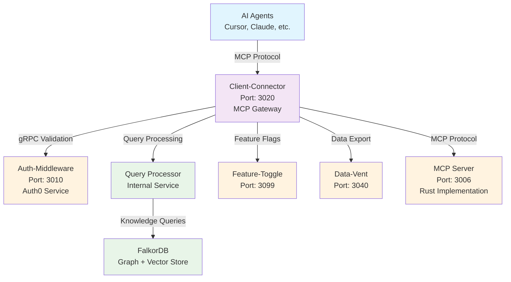

# ConFuse Client Connector

> **MCP Protocol Gateway for AI Agents**

## What is this service?

The **client-connector** is ConFuse's dedicated **MCP (Model Context Protocol) gateway** that enables AI agents (Cursor, Claude, etc.) to securely connect to and query the ConFuse knowledge platform. It acts as the bridge between AI agents and the ConFuse infrastructure.

## Quick Start

```bash
# Clone and install
git clone https://github.com/confuse/client-connector.git
cd client-connector

# Setup Python environment
python -m venv .venv
source .venv/bin/activate  # Linux/Mac
# or .venv\Scripts\activate  # Windows

# Install dependencies
pip install -e .

# Configure environment
cp .env.map.example .env.map
cp .env.secret.example .env.secret

# Start the service
uvicorn app.main:app --host 0.0.0.0 --port 3020
```

The service starts at:
- **HTTP**: `http://localhost:3020`
- **WebSocket**: `/ws` endpoint for MCP connections

## Documentation

| Document | Description |
|----------|-------------|
| [Architecture](architecture.md) | MCP gateway design and flows |
| [API Reference](api-reference.md) | REST and WebSocket endpoints |
| [Configuration](configuration.md) | Environment variables |
| [MCP Integration](mcp-integration.md) | MCP protocol implementation |
| [Agent Setup](agent-setup.md) | How to connect AI agents |

## How It Fits in ConFuse



## Key Features

### 1. **MCP Protocol Gateway**
- **Native MCP Support**: Full Model Context Protocol implementation
- **WebSocket Connections**: Real-time bidirectional communication
- **Agent Authentication**: Secure agent identity verification
- **Session Management**: Persistent agent sessions with context

### 2. **AI Agent Integration**
- **Multi-Agent Support**: Cursor, Claude, and other MCP-compatible agents
- **Query Processing**: Intelligent query routing and optimization
- **Context Preservation**: Session-based context and history
- **Error Handling**: Graceful error responses for agents

### 3. **Security & Authentication**
- **Auth0 Integration**: JWT token validation via auth-middleware
- **Agent Authorization**: Role-based access control for agents
- **Rate Limiting**: Query throttling and abuse prevention
- **Audit Logging**: Complete query audit trail

### 4. **Knowledge Graph Access**
- **Semantic Search**: Vector-based similarity queries
- **Graph Traversal**: Relationship and entity queries
- **Multi-Modal**: Code, documents, and structured data access
- **Real-time Sync**: Live knowledge graph updates

## Technology Stack

| Technology | Purpose | Version |
|------------|---------|---------|
| **Python** | Runtime | >=3.14 |
| **FastAPI** | Web Framework | >=0.109.0 |
| **FastMCP** | MCP Protocol | >=0.2.0 |
| **WebSockets** | Real-time Communication | >=12.0 |
| **AsyncPG** | PostgreSQL Driver | >=0.29.0 |
| **SQLAlchemy** | ORM | >=2.0.25 |
| **Pydantic** | Data Validation | >=2.5.0 |
| **Structlog** | Structured Logging | >=24.1.0 |

## Service Architecture

### Core Components

#### 1. **MCP Gateway**
- **Protocol Handler**: FastMCP server implementation
- **WebSocket Manager**: Connection lifecycle management
- **Message Router**: MCP message routing and processing
- **Session Store**: Agent session persistence

#### 2. **Query Processor**
- **Query Parser**: MCP query language parsing
- **Query Router**: Intelligent query routing to knowledge graph
- **Result Formatter**: Response formatting for agents
- **Cache Manager**: Query result caching

#### 3. **Authentication Layer**
- **JWT Validator**: Token validation via auth-middleware
- **Agent Registry**: Agent identity and permissions
- **Session Auth**: WebSocket session authentication
- **Authorization Engine**: Permission checking

#### 4. **Integration Layer**
- **FalkorDB Client**: Knowledge graph connection
- **Feature Toggle**: Dynamic feature management
- **Metrics Collector**: Performance and usage metrics
- **Event Publisher**: Query event streaming

## API Endpoints

### REST API (Port 3020)
```
GET  /health                    - Health check
GET  /agents                   - List connected agents
GET  /agents/{agent_id}        - Get agent details
POST /agents/{agent_id}/disconnect - Disconnect agent
GET  /metrics                  - Service metrics
GET  /status                   - Service status
```

### WebSocket Endpoint
```
WS   /ws                       - MCP protocol endpoint
```

### MCP Protocol Messages
```
initialize                     - Initialize MCP session
tools/list                     - List available tools
tools/call                     - Execute tool
resources/list                 - List knowledge resources
resources/read                 - Read resource content
prompts/list                   - List available prompts
prompts/get                    - Get prompt template
```

## Environment Configuration

### Required Environment Variables

#### `.env.map` (Non-sensitive)
```bash
PORT=3020
HOST=0.0.0.0
ENVIRONMENT=production
MCP_SERVER_URL=http://mcp-server:3006
MCP_SERVER_MODE=http
AUTH_MIDDLEWARE_GRPC_ADDR=http://auth-middleware:3010
FEATURE_TOGGLE_SERVICE_URL=http://feature-toggle:3099
DATA_VENT_URL=http://data-vent:3040
EMBEDDINGS_SERVICE_URL=http://embeddings-service:3001
CORS_ORIGINS=http://localhost:3000,http://localhost:8080
LOG_LEVEL=INFO

# PostgreSQL Configuration
POSTGRES_HOST=ep-small-voice-a1o0n6xl-pooler.ap-southeast-1.aws.neon.tech
POSTGRES_PORT=5432
POSTGRES_DATABASE=neondb
POSTGRES_USER=neondb_owner
POSTGRES_SSL=true
```

#### `.env.secret` (Sensitive)
```bash
POSTGRES_PASSWORD=your_postgres_password
JWT_SECRET_KEY=your_jwt_secret
MCP_SERVER_API_KEY=your_mcp_api_key
```

## Service Dependencies

| Service | Dependency Type | Purpose |
|---------|-----------------|---------|
| **Auth-Middleware** | Internal | JWT validation and authentication |
| **FalkorDB** | Database | Knowledge graph storage and queries |
| **Feature-Toggle** | Internal | Dynamic feature flag support |
| **Data-Vent** | Internal | Data export and streaming |
| **PostgreSQL** | Database | Agent session and metadata storage |

## MCP Protocol Implementation

### Supported MCP Operations

#### 1. **Tool Operations**
```python
# Semantic search tool
tools/call {
    "name": "semantic_search",
    "arguments": {
        "query": "React hooks usage patterns",
        "limit": 10,
        "filters": {"language": "javascript"}
    }
}

# Code analysis tool
tools/call {
    "name": "analyze_code",
    "arguments": {
        "file_path": "src/components/Button.tsx",
        "analysis_type": "complexity"
    }
}
```

#### 2. **Resource Operations**
```python
# List knowledge resources
resources/list {
    "uri": "confuse://knowledge/*"
}

# Read specific resource
resources/read {
    "uri": "confuse://knowledge/components/Button"
}
```

#### 3. **Prompt Operations**
```python
# List available prompts
prompts/list {}

# Get specific prompt
prompts/get {
    "name": "code_review",
    "arguments": {"language": "typescript"}
}
```

## Agent Integration

### Supported AI Agents

#### 1. **Cursor**
- **Connection**: MCP WebSocket connection
- **Authentication**: JWT token-based
- **Features**: Code search, documentation lookup, analysis

#### 2. **Claude Desktop**
- **Connection**: MCP server integration
- **Authentication**: Auth0-based
- **Features**: Knowledge retrieval, semantic search

#### 3. **Custom Agents**
- **SDK**: MCP client libraries
- **Authentication**: OAuth 2.0 or API keys
- **Features**: Full MCP protocol support

### Agent Setup Example

```python
# Python MCP Client Example
import asyncio
from mcp import Client

async def connect_to_confuse():
    client = Client("confuse-client")
    
    # Connect to ConFuse client-connector
    await client.connect("ws://localhost:3020/ws")
    
    # Initialize session
    await client.initialize({
        "protocolVersion": "2024-11-05",
        "capabilities": {
            "tools": {},
            "resources": {}
        },
        "clientInfo": {
            "name": "CustomAgent",
            "version": "1.0.0"
        }
    })
    
    # Search knowledge base
    result = await client.call_tool("semantic_search", {
        "query": "React component patterns",
        "limit": 5
    })
    
    return result
```

## Query Processing Pipeline

### Query Flow
1. **Agent Request**: MCP query received via WebSocket
2. **Authentication**: JWT validation via auth-middleware
3. **Query Parsing**: MCP message parsing and validation
4. **Query Routing**: Route to appropriate knowledge graph query
5. **Execution**: FalkorDB query execution
6. **Result Processing**: Format results for MCP response
7. **Response**: Return results to agent

### Query Types
- **Semantic Search**: Vector similarity queries
- **Graph Traversal**: Relationship and entity queries
- **Code Analysis**: AST-based code queries
- **Document Search**: Full-text document queries

## Monitoring & Observability

### Logging
- **Structured JSON logs** via Structlog
- **MCP message logging** for debugging
- **Query performance** metrics
- **Agent session** tracking

### Metrics
- **Active agents** and sessions
- **Query latency** and throughput
- **Error rates** by query type
- **Resource usage** statistics

### Health Checks
```bash
# Service health
GET /health

# Detailed status
GET /status

# Agent status
GET /agents
```

## Development

### Local Development Setup
```bash
# Install development dependencies
pip install -e ".[dev]"

# Run tests
pytest

# Code formatting
black app/
ruff check app/

# Start development server
uvicorn app.main:app --reload --host 0.0.0.0 --port 3020
```

### Testing
```bash
# Run unit tests
pytest tests/unit/

# Run integration tests
pytest tests/integration/

# Run with coverage
pytest --cov=app tests/
```

## Troubleshooting

### Common Issues

#### "MCP connection failed"
- Verify MCP server URL in configuration
- Check WebSocket endpoint accessibility
- Ensure agent supports MCP protocol

#### "Authentication failed"
- Verify JWT token validity
- Check auth-middleware connectivity
- Ensure proper CORS configuration

#### "Query timeout"
- Check FalkorDB connection
- Verify query complexity limits
- Monitor resource utilization

## Security Considerations

### Agent Authentication
- **JWT Validation**: All agent requests must include valid JWT
- **Session Management**: Secure WebSocket session handling
- **Rate Limiting**: Prevent query abuse and DoS attacks

### Data Protection
- **Query Filtering**: Prevent unauthorized data access
- **Result Sanitization**: Remove sensitive information from responses
- **Audit Trail**: Complete query logging for compliance

## License

Proprietary - ConFuse Team
