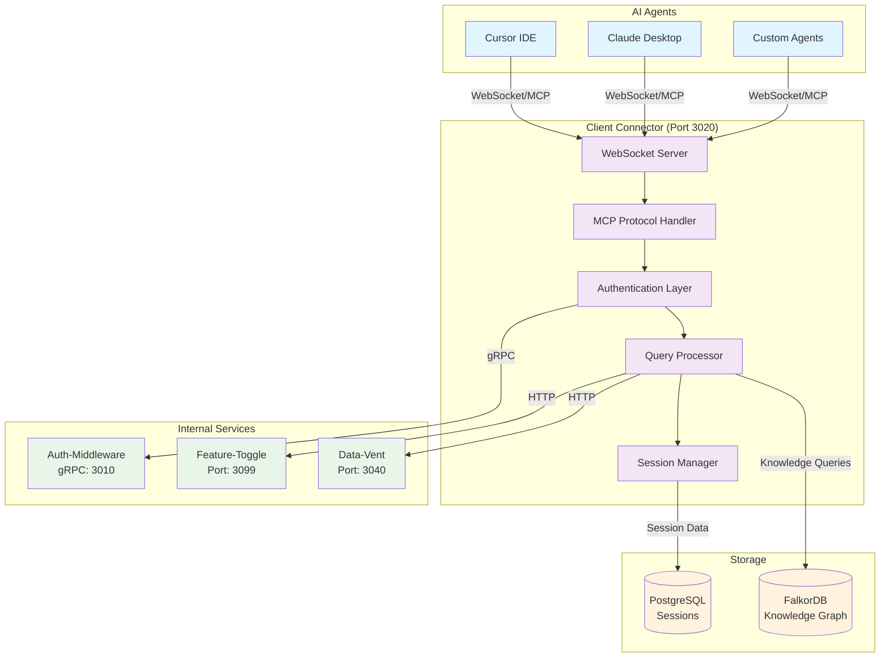
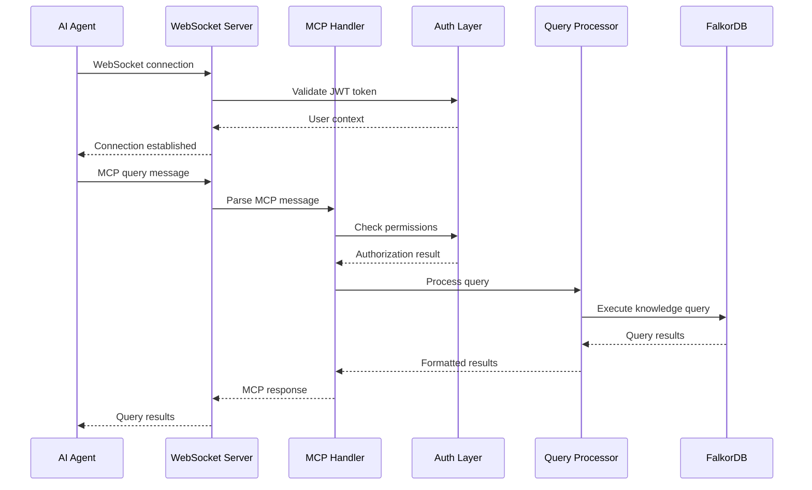
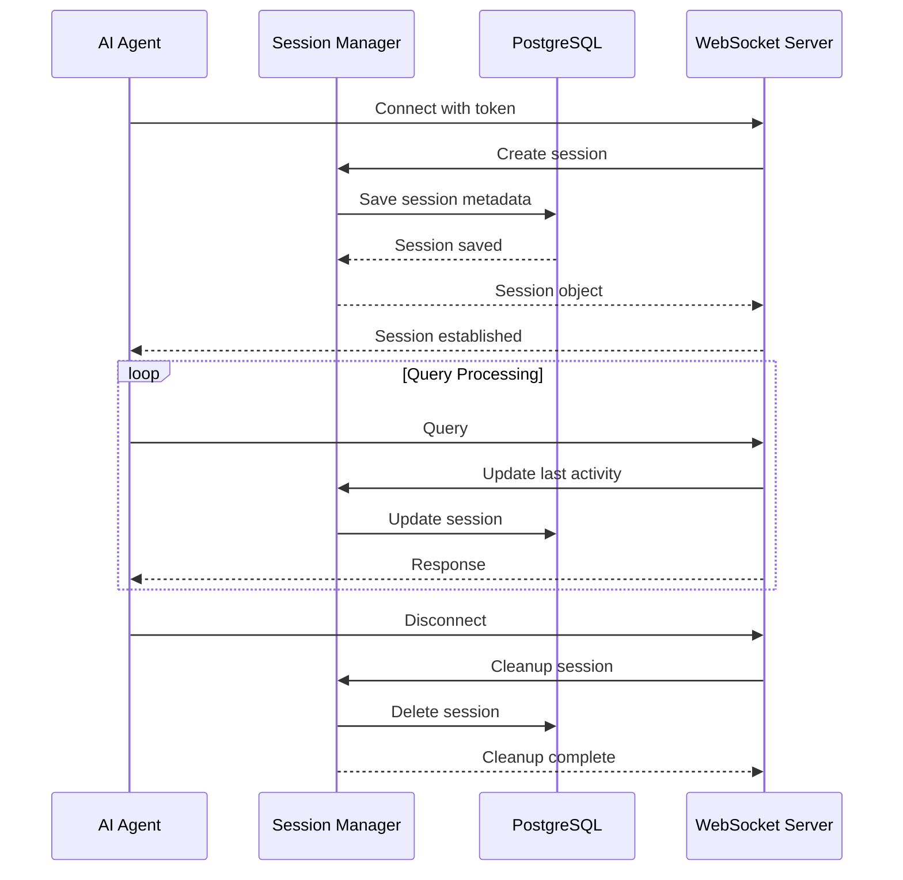

# Client Connector Architecture

> **MCP Gateway Design and Implementation Details**

## System Architecture Overview



## Core Components

### 1. **WebSocket Server**
**Purpose**: Handle incoming WebSocket connections from AI agents

**Key Features**:
- **Connection Management**: Accept/reject connections based on auth status
- **Message Routing**: Route MCP messages to appropriate handlers
- **Heartbeat Monitoring**: Keep-alive and connection health monitoring
- **Graceful Shutdown**: Clean connection termination

**Implementation Details**:
```python
# FastAPI WebSocket endpoint
@app.websocket("/ws")
async def websocket_endpoint(websocket: WebSocket):
    await websocket.accept()
    
    # Authenticate connection
    token = websocket.query_params.get("token")
    user = await authenticate_websocket(token)
    
    # Create session
    session = await session_manager.create_session(websocket, user)
    
    try:
        while True:
            message = await websocket.receive_text()
            await mcp_handler.handle_message(session, message)
    except WebSocketDisconnect:
        await session_manager.cleanup_session(session)
```

### 2. **MCP Protocol Handler**
**Purpose**: Implement the Model Context Protocol for agent communication

**Key Features**:
- **Protocol Compliance**: Full MCP 2024-11-05 specification
- **Message Parsing**: JSON-RPC 2.0 message handling
- **Tool Registration**: Dynamic tool and capability registration
- **Error Handling**: Standardized MCP error responses

**Supported MCP Operations**:

#### **Initialize**
```python
async def handle_initialize(session: AgentSession, params: dict):
    # Validate protocol version
    if params["protocolVersion"] != "2024-11-05":
        raise MCPError("Unsupported protocol version")
    
    # Register capabilities
    session.capabilities = {
        "tools": {"listChanged": True},
        "resources": {"subscribe": True},
        "prompts": {"listChanged": True}
    }
    
    return {
        "protocolVersion": "2024-11-05",
        "capabilities": session.capabilities,
        "serverInfo": {
            "name": "ConFuse Client Connector",
            "version": "0.1.0"
        }
    }
```

#### **Tools Operations**
```python
async def handle_tools_call(session: AgentSession, params: dict):
    tool_name = params["name"]
    arguments = params.get("arguments", {})
    
    if tool_name == "semantic_search":
        return await query_processor.semantic_search(arguments)
    elif tool_name == "code_analysis":
        return await query_processor.code_analysis(arguments)
    else:
        raise MCPError(f"Unknown tool: {tool_name}")
```

### 3. **Authentication Layer**
**Purpose**: Secure agent authentication and authorization

**Key Features**:
- **JWT Validation**: Token validation via auth-middleware gRPC
- **Agent Registry**: Agent identity and permission management
- **Session Security**: Secure WebSocket session establishment
- **Authorization Checks**: Per-operation permission validation

**Authentication Flow**:
```python
async def authenticate_websocket(token: str) -> AuthUser:
    # Validate JWT with auth-middleware
    async with grpc.aio.insecure_channel(AUTH_MIDDLEWARE_GRPC_ADDR) as channel:
        stub = auth_pb2_grpc.AuthServiceStub(channel)
        request = auth_pb2.ValidateTokenRequest(token=token)
        response = await stub.ValidateToken(request)
        
        if not response.valid:
            raise WebSocketException(code=1008, reason="Invalid token")
    
    return AuthUser(
        id=response.user_id,
        email=response.email,
        permissions=response.permissions
    )
```

### 4. **Query Processor**
**Purpose**: Process agent queries and route to knowledge graph

**Key Features**:
- **Query Parsing**: MCP query language parsing
- **Query Optimization**: Query plan optimization
- **Result Formatting**: MCP-compliant response formatting
- **Cache Management**: Query result caching

**Query Processing Pipeline**:
```python
class QueryProcessor:
    async def process_query(self, session: AgentSession, query: str) -> dict:
        # Parse and validate query
        parsed_query = await self.parse_query(query)
        
        # Check authorization
        await self.authorize_query(session.user, parsed_query)
        
        # Execute query
        if parsed_query.type == "semantic_search":
            results = await self.semantic_search(parsed_query)
        elif parsed_query.type == "graph_traversal":
            results = await self.graph_traversal(parsed_query)
        else:
            raise MCPError(f"Unsupported query type: {parsed_query.type}")
        
        # Format results for MCP
        return self.format_mcp_response(results)
```

### 5. **Session Manager**
**Purpose**: Manage agent sessions and state

**Key Features**:
- **Session Lifecycle**: Create, maintain, and cleanup sessions
- **Context Preservation**: Maintain conversation context
- **Resource Tracking**: Track session resource usage
- **Multi-Agent Support**: Handle concurrent agent sessions

**Session Management**:
```python
class SessionManager:
    def __init__(self):
        self.sessions: Dict[str, AgentSession] = {}
        self.session_store = SessionStore()
    
    async def create_session(self, websocket: WebSocket, user: AuthUser) -> AgentSession:
        session_id = str(uuid.uuid4())
        session = AgentSession(
            id=session_id,
            websocket=websocket,
            user=user,
            created_at=datetime.utcnow(),
            last_activity=datetime.utcnow()
        )
        
        self.sessions[session_id] = session
        await self.session_store.save_session(session)
        
        return session
```

## Data Flow Architecture

### Query Processing Flow


### Session Management Flow


## Security Architecture

### Authentication Layers
1. **Transport Layer**: TLS/WSS encryption
2. **Application Layer**: JWT token validation
3. **Authorization Layer**: Permission-based access control
4. **Session Layer**: Secure WebSocket session management

### Security Controls
- **Input Validation**: All MCP messages validated
- **Rate Limiting**: Query throttling per agent
- **Audit Logging**: All queries and actions logged
- **Error Sanitization**: Sensitive information removed from errors

## Performance Architecture

### Caching Strategy
- **Query Results**: Cache frequent query results
- **User Sessions**: Cache active session data
- **Knowledge Graph**: Cache graph traversal results
- **Tool Metadata**: Cache tool definitions and capabilities

### Scalability Design
- **Horizontal Scaling**: Multiple instances behind load balancer
- **Connection Pooling**: Database connection pooling
- **Async Processing**: Non-blocking I/O throughout
- **Resource Limits**: Configurable resource limits per session

## Integration Architecture

### External Service Integration
```python
# Auth-Middleware Integration
class AuthService:
    def __init__(self):
        self.channel = grpc.aio.insecure_channel(AUTH_MIDDLEWARE_GRPC_ADDR)
        self.stub = auth_pb2_grpc.AuthServiceStub(self.channel)
    
    async def validate_token(self, token: str) -> AuthUser:
        request = auth_pb2.ValidateTokenRequest(token=token)
        response = await self.stub.ValidateToken(request)
        return AuthUser.from_proto(response)

# Feature Toggle Integration
class FeatureToggleService:
    def __init__(self):
        self.base_url = FEATURE_TOGGLE_SERVICE_URL
    
    async def is_enabled(self, feature: str, user_id: str) -> bool:
        async with httpx.AsyncClient() as client:
            response = await client.get(
                f"{self.base_url}/features/{feature}/check",
                params={"user_id": user_id}
            )
            return response.json()["enabled"]
```

### Database Integration
```python
# PostgreSQL Session Storage
class SessionStore:
    def __init__(self):
        self.pool = asyncpg.create_pool(DATABASE_URL)
    
    async def save_session(self, session: AgentSession):
        async with self.pool.acquire() as conn:
            await conn.execute(
                """
                INSERT INTO agent_sessions (id, user_id, created_at, last_activity, metadata)
                VALUES ($1, $2, $3, $4, $5)
                ON CONFLICT (id) DO UPDATE SET
                    last_activity = $4,
                    metadata = $5
                """,
                session.id, session.user.id, session.created_at,
                session.last_activity, json.dumps(session.metadata)
            )

# FalkorDB Knowledge Graph
class KnowledgeGraphClient:
    def __init__(self):
        self.client = FalkorDBClient(FALKORDB_URL)
    
    async def semantic_search(self, query: str, limit: int = 10) -> List[dict]:
        results = await self.client.query(
            """
            CALL db.query.vector.search(
                'Vector_Chunk', 
                $embedding, 
                {limit: $limit}
            ) YIELD node, score
            RETURN node.content as content, node.metadata as metadata, score
            """,
            embedding=await self.generate_embedding(query),
            limit=limit
        )
        return results
```

## Error Handling Architecture

### Error Categories
1. **Protocol Errors**: MCP protocol violations
2. **Authentication Errors**: Invalid/expired tokens
3. **Authorization Errors**: Insufficient permissions
4. **Query Errors**: Invalid queries or execution failures
5. **System Errors**: Infrastructure failures

### Error Response Format
```python
class MCPError(Exception):
    def __init__(self, message: str, code: int = -32603, data: dict = None):
        self.message = message
        self.code = code
        self.data = data or {}
    
    def to_mcp_response(self) -> dict:
        return {
            "error": {
                "code": self.code,
                "message": self.message,
                "data": self.data
            }
        }
```

## Monitoring & Observability

### Metrics Collection
- **Connection Metrics**: Active sessions, connection rates
- **Query Metrics**: Query latency, throughput, error rates
- **Resource Metrics**: Memory, CPU, database connections
- **Business Metrics**: Agent usage patterns, popular queries

### Logging Strategy
- **Structured Logging**: JSON format with correlation IDs
- **Log Levels**: DEBUG, INFO, WARNING, ERROR
- **Log Aggregation**: Centralized log collection
- **Security Logging**: Authentication and authorization events

## Deployment Architecture

### Container Configuration
```dockerfile
FROM python:3.14-slim

WORKDIR /app

# Install dependencies
COPY requirements.txt .
RUN pip install -r requirements.txt

# Copy application
COPY . .

# Expose port
EXPOSE 3020

# Health check
HEALTHCHECK --interval=30s --timeout=10s --start-period=5s --retries=3 \
    CMD curl -f http://localhost:3020/health || exit 1

# Start application
CMD ["uvicorn", "app.main:app", "--host", "0.0.0.0", "--port", "3020"]
```

### Environment Configuration
- **Development**: Local configuration with hot reload
- **Staging**: Pre-production testing environment
- **Production**: High-availability deployment with monitoring

This architecture provides a robust, scalable, and secure foundation for AI agent integration with the ConFuse knowledge platform.
